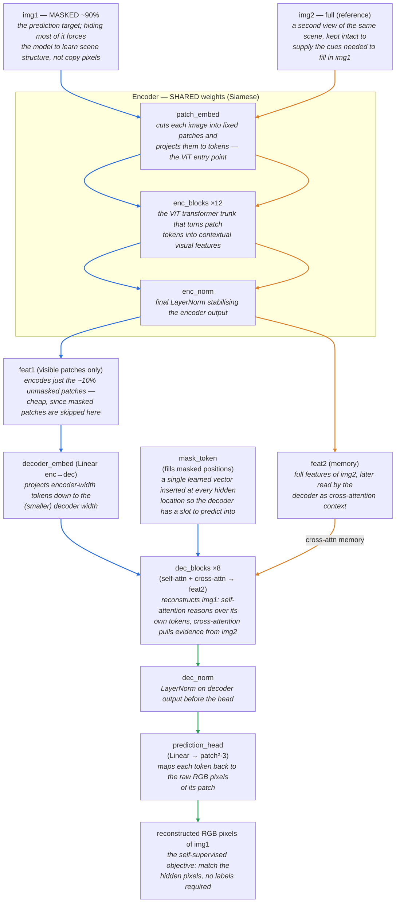
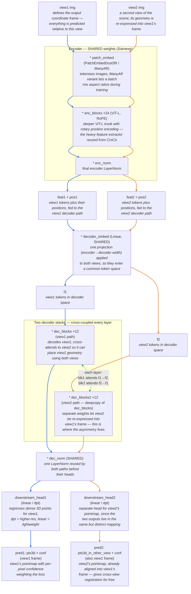

# CroCo v2 vs. DUSt3R — architecture & weight sharing

Two diagrams + a sharing table. DUSt3R (`AsymmetricCroCo3DStereo`,
`dust3r/model.py`) subclasses CroCo (`CroCoNet`, `croco/models/croco.py`) and
reuses its encoder/decoder weights, so it helps to see them side by side.

## 1. CroCo v2 (self-supervised pretraining)

One Siamese **encoder**, one **decoder**, one **pixel-reconstruction head**.
The asymmetry is *masking*: image 1 is ~90% masked and reconstructed using the
full image 2 as cross-attention "memory".

**Edge colours:** ■ blue = img1 stream · ■ orange = img2 stream · ■ green = the two views fused / no longer separable. Where a *shared* module is applied to each image in turn, the arrow is **duplicated** (one blue, one orange) to show both images traverse the same weights.

## 2. DUSt3R (`AsymmetricCroCo3DStereo`)

Same Siamese **encoder**, but now **two cross-coupled decoders** and **two
pointmap heads**. No masking, no pixel head. Both outputs are 3D pointmaps in
**view1's coordinate frame** (the asymmetry is now in the *coordinate frame*,
realised by the two separate decoder stacks).

**`*` marks parts pretrained by CroCo v2's self-supervised training** (and thus
loaded from its checkpoint — for the parts DUSt3R keeps, these two are the same
set). Unmarked parts are DUSt3R-specific and trained from scratch.

**Edge colours:** ■ blue = view1 stream · ■ orange = view2 stream · ■ green = cross-coupling where the two paths exchange information. The two streams never merge into one tensor — they stay separate end to end — so the only green edge is the per-layer cross-attention between the decoders. Shared modules (`decoder_embed`, `dec_norm`) get **duplicated** arrows, one per view.

> Note on `* dec_blocks2`: there is no `dec_blocks2` in the CroCo checkpoint —
> it is populated by **duplicating** the `dec_blocks` weights at load time
> (`load_state_dict`, `model.py:91-98`), so it still *originates* from CroCo.

## 3. Every node, side by side

One row per node appearing in either diagram. **CroCo** / **DUSt3R** columns say
whether that node is part of the forward pass in each model (✅ used · ⚪️
present-but-inactive · ❌ absent). Names in `code font` are the actual attribute
names in `croco/models/croco.py` / `dust3r/model.py`.

| Node (diagram label) | CroCo | DUSt3R | What it is and why it's there |
|---|:---:|:---:|---|
| **Input image** (`img1`/`view1`, `img2`/`view2`) | ✅ | ✅ | The two RGB images of the scene. **CroCo:** `img1` is heavily masked (the reconstruction target), `img2` is intact and serves only as a reference. **DUSt3R:** neither is masked; both are full images, and `view1` additionally *defines the output coordinate frame* — every predicted 3D point, for both views, is expressed relative to `view1`'s camera. |
| **`patch_embed`** | ✅ | ✅ | Conv/linear projection that slices each image into non-overlapping patches and embeds each as a token — the ViT entry point. CroCo uses plain `PatchEmbed`; DUSt3R swaps in `PatchEmbedDust3R` (fixed shape, inference) or `ManyAR_PatchEmbed` (lets one batch mix aspect ratios during training). Same weight dimensions, so CroCo's weights load directly. |
| **`enc_blocks`** | ✅ ×12 | ✅ ×24 | The ViT transformer trunk: stacked self-attention blocks that turn patch tokens into contextual visual features. This is the heavy feature extractor and the **main thing reused from CroCo** (ViT-L, ×24, with RoPE in the v2 backbone). Run **Siamese** — the same weights process both images, in fact as one concatenated batch (`_encode_image_pairs`). |
| **`enc_norm`** | ✅ | ✅ | Final `LayerNorm` applied to the encoder output. Shared across both images; transfers verbatim from CroCo. |
| **`feat1` / `feat2`** (encoder output) | ✅ | ✅ | The per-image encoder feature tokens. **CroCo:** `feat1` covers only the ~10% *visible* patches (masked patches are skipped here for efficiency), while `feat2` is the full feature set used as cross-attention memory. **DUSt3R:** `feat1`/`feat2` are the full token sets, each carried with its positional encoding (`pos1`/`pos2`) into its own decoder path. Not a learned module — just the activation tensors flowing between encoder and decoder. |
| **`mask_token`** | ✅ | ⚪️ | A single learned vector inserted at every *hidden* patch position so the decoder has a slot to predict into. **Essential to CroCo's masked-reconstruction objective.** DUSt3R inherits the parameter (it's defined on `CroCoNet`) but never masks anything, so it is **unused** at train and inference time — dead weight kept only because the class is subclassed. |
| **`decoder_embed`** | ✅ | ✅ | Linear projection from encoder width to the (smaller) decoder width, so tokens enter the decoder's token space. In DUSt3R it is a **single shared instance** applied to *both* view streams in turn (hence the duplicated arrows in the diagram). Transfers from CroCo. |
| **`f1` / `f2`** (decoder-space tokens) | — | ✅ | DUSt3R-only intermediate: the outputs of `decoder_embed`, i.e. `feat1`/`feat2` re-expressed in decoder width, ready to feed the two decoder stacks. (CroCo has the analogous tensor but the diagram doesn't name it separately.) Activations, not a module. |
| **`dec_blocks`** | ✅ | ✅ | The transformer decoder stack. **CroCo:** the *only* decoder — self-attention over `img1`'s tokens plus cross-attention into `feat2`, reconstructing `img1`. **DUSt3R:** this becomes the **`view1` path** (one of two stacks). Each layer does self-attention *and* cross-attention to the other view's tokens. CroCo's decoder weights initialise it. |
| **`dec_blocks2`** | ❌ | ✅ | DUSt3R's **second decoder stack**, the `view2` path. It does **not** exist in the CroCo checkpoint; it is created by `deepcopy`-ing `dec_blocks` and populated by duplicating those weights at load (`load_state_dict`, `model.py:91-98`), then diverges during training. **This second stack is where the asymmetry lives** — it re-expresses `view2`'s geometry into `view1`'s frame. Cross-coupled with `dec_blocks` every layer (the green edge). |
| **`dec_norm`** | ✅ | ✅ | `LayerNorm` on the decoder output before the head. In DUSt3R a **single shared instance** normalises both decoder paths (duplicated arrows). Transfers from CroCo. |
| **`prediction_head`** | ✅ | ❌ | CroCo's output head: a `Linear` mapping each decoder token back to its patch's raw RGB pixels (`patch²·3`) for the reconstruction loss. **DUSt3R removes it entirely** — `_set_prediction_head` is a no-op — because DUSt3R predicts geometry, not pixels. |
| **`downstream_head1` / `downstream_head2`** | ❌ | ✅ | DUSt3R's **two pointmap heads** (`linear` for the 224 model, `dpt` for higher-res 512 models). Each regresses, per pixel, a 3D point `(x,y,z)` plus a confidence scalar. Separate instances for the two views. **New to DUSt3R, trained from scratch** (no CroCo counterpart). |
| **Output** (`reconstructed RGB` / `pred1`,`pred2`) | ✅ | ✅ | **CroCo:** the reconstructed RGB pixels of the masked `img1` — the self-supervised target, no labels needed. **DUSt3R:** `pred1` = `view1`'s pointmap + confidence (in `view1` frame); `pred2` = `view2`'s pointmap + confidence, already aligned **into `view1`'s frame** (`pts3d_in_other_view`), which is what gives cross-view registration for free. |

### Key takeaways
- **Encoder (`patch_embed` → `enc_blocks` → `enc_norm`) is fully shared** between
  the two images *and* transfers verbatim from CroCo — that's why warm-starting
  from `CroCo_V2_ViTLarge_BaseDecoder.pth` works.
- **The two decoders are where the asymmetry lives.** `dec_blocks2` starts as an
  exact copy of `dec_blocks` (duplicated at checkpoint load) and then diverges
  during training; each layer they cross-attend to each other, so information
  flows between the two views at every decoder block.
- **`decoder_embed` and `dec_norm` are shared** across both decoder paths; only
  the decoder blocks and the output heads are duplicated.
- **What changes from CroCo to DUSt3R is only the ends:** masking and the
  pixel `prediction_head` are dropped (and `mask_token` goes unused), and two
  `downstream_head`s predict pointmaps instead. Everything in between is reused.
